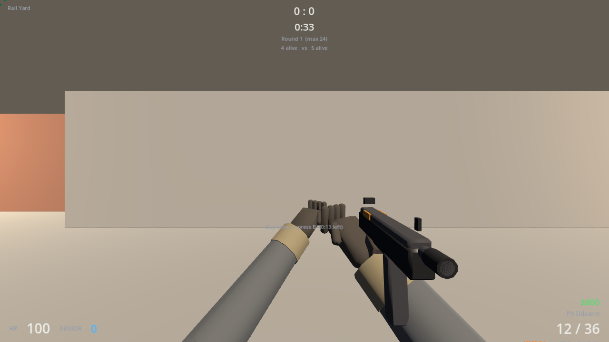
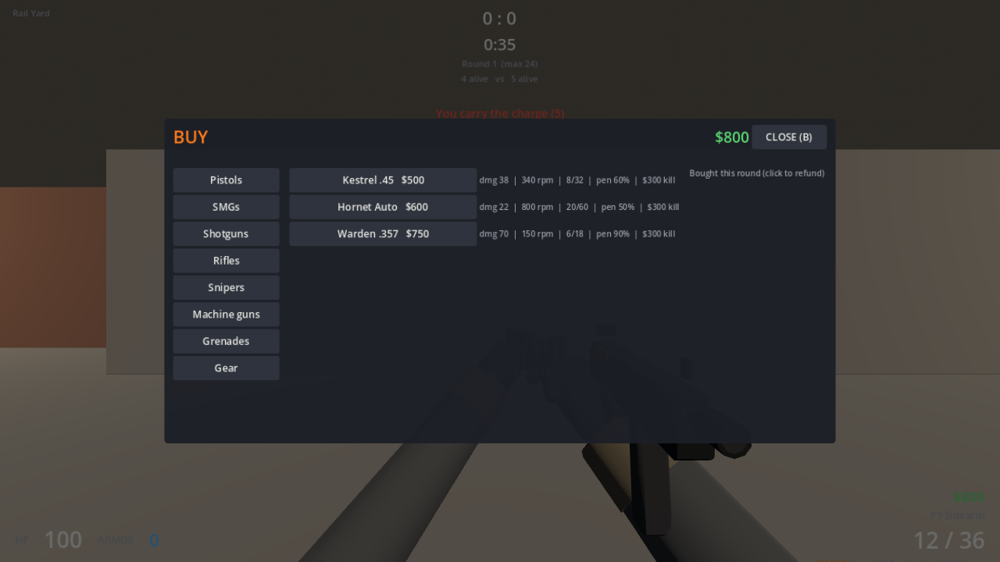
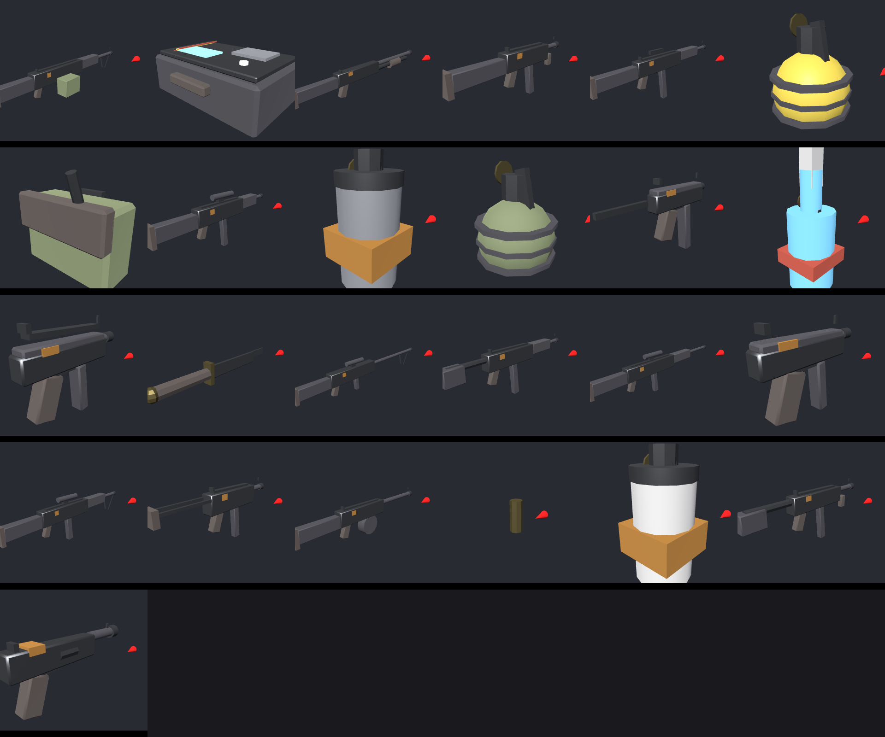
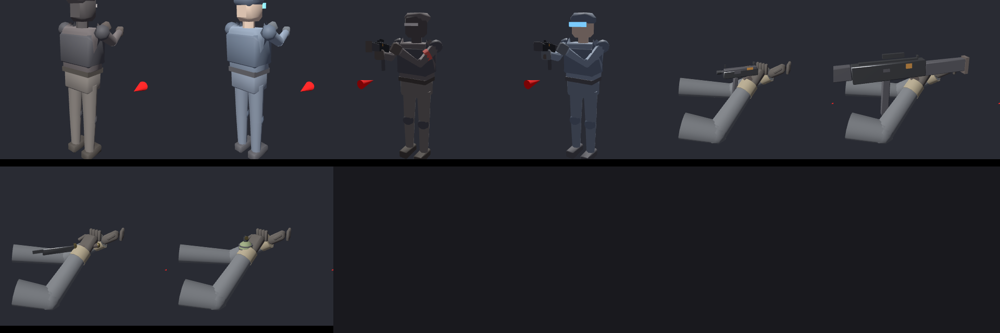

# Breachline

An original 5v5 tactical bomb-defusal FPS built with **Godot 4.4 (GDScript)**, with every 3D asset
generated by **Blender Python** scripts. No third-party game content is used: the title, factions
(Cinder Syndicate vs Aegis Directorate), the map *Foundry*, the arsenal, the UI and every sound
are original and produced by the scripts in this repository.

| | |
|---|---|
|  |  |
|  |  |

* `breachline/` – the Godot project (open it in Godot 4.4, or run headless, see below)
* `blender/scripts/` – bpy asset generators + batch export; `blender/source/` – editable `.blend` files
* `tools/` – audio synthesis, weapon data generation, asset gallery renderer
* `docs/` – [SETUP](docs/SETUP.md) · [CONTROLS](docs/CONTROLS.md) · [ARCHITECTURE](docs/ARCHITECTURE.md) · [MULTIPLAYER](docs/MULTIPLAYER.md) · [BLENDER_PIPELINE](docs/BLENDER_PIPELINE.md) · [ASSET_LICENSES](docs/ASSET_LICENSES.md) · [KNOWN_LIMITATIONS](docs/KNOWN_LIMITATIONS.md)
* [PROGRESS.md](PROGRESS.md) – feature checklist with what has actually been tested

Quick start (Godot 4.4 binary on your PATH as `godot`):

```
godot --path breachline                       # play (main menu -> PLAY WITH BOTS)
godot --headless --path breachline -s tests/run_tests.gd        # 295 automated checks
godot --headless --path breachline -- --server --port 27015 --bots 8   # dedicated server
godot --path breachline -- --connect 127.0.0.1:27015           # join it
```

The repository root also still hosts the unrelated `index.html` web app that lived on this branch
before the game was added.
